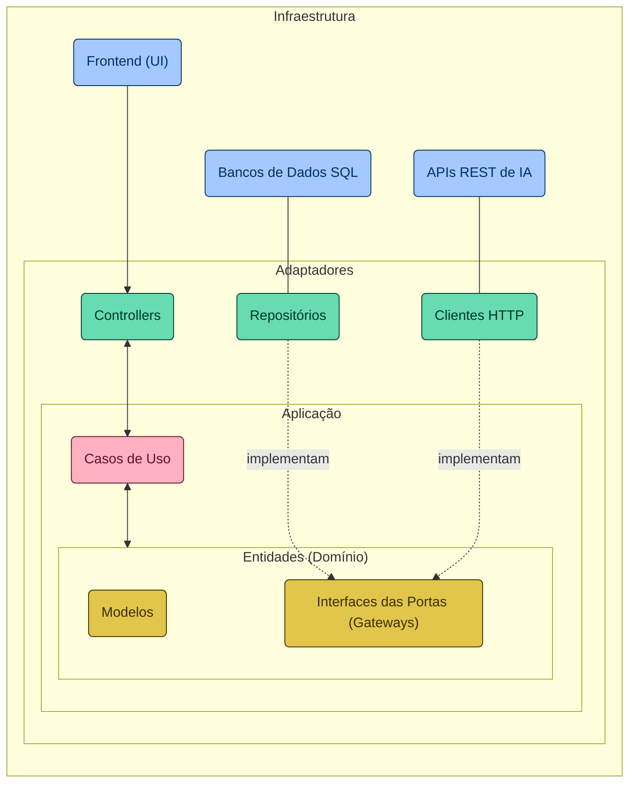

# Santander Dev Week 2024

## Sobre o Projeto

Repositório voltado ao desenvolvimento de uma REST API + FrontEnd, fruto de uma colaboração entra a DIO e o Santander. Construída em Java 21 e Spring Boot 3, o projeto será desenvolvido em 4 dias com o seguinte propósito:

> [!NOTE]
> Objetivo: "Permitir que os usuários conversem com os campeões do League of Legends (LOL)".

Deste modo, serão utilizadas algumas das mais recentes Inteligências Artificiais (IAs) Generativas, possibilitando que a API "entenda" a personalidade única de cada campeão para criar interações que capturam sua essência, tornando cada conversa uma experiência única.

## Arquitetura do Projeto

### Diagrama Arquitetural

### Estrutura de Diretórios

Clean Architecture simplificada, visando a uma clara separação das responsabilidades e promovendo a autonomia das camadas em um projeto Spring Boot.

-   `adapters/`: Inclui os adaptadores que facilitam a comunicação entre a aplicação e o mundo externo (único diretório que "conhece" o Spring).
    -   `in/`: Abriga os adaptadores de entrada, tais como controladores REST, que lidam com as requisições dos usuários.
    -   `out/`: Contém os adaptadores de saída, responsáveis da interação com bancos de dados e APIs externas, por exemplo.
-   `application/`: Hospeda os casos de uso da aplicação, encapsulando a lógica de negócios essencial.
-   `domain/`: Representa o coração da aplicação, englobando entidades, exceções e interfaces (portas) que articulam as regras de negócio fundamentais.
    -   `exception/`: Define as exceções personalizadas pertinentes ao domínio.
    -   `model/`: Modela as entidades do domínio, refletindo os conceitos centrais da aplicação.
    -   `ports/`: Estabelece as interfaces que delineiam os contratos para os adaptadores e serviços externos.
-   `Application.java`: A classe principal que orquestra a configuração e o execução da aplicação.

### Banco de Dados SQL em Memória

A utilização do banco de dados H2 neste projeto serve como uma fundação ágil e flexível para modelar nosso domínio de conhecimento — os campeões do LOL. Essa escolha permite uma rápida prototipação e um ambiente de desenvolvimento eficiente, essencial para armazenar e recuperar informações detalhadas sobre cada campeão. Dessa forma, garantimos que as IAs Generativas que integramos possam acessar um repositório rico e detalhado, permitindo-lhes capturar com precisão a essência e a personalidade única de cada campeão, enriquecendo assim a interatividade e a profundidade das interações realizadas.

> [!NOTE]
> README.md inspirado no [Repositório Oficial do Santander Dev Week 2024](https://github.com/digitalinnovationone/santander-dev-week-2024) do GitHub da [DIO](https://github.com/digitalinnovationone).
